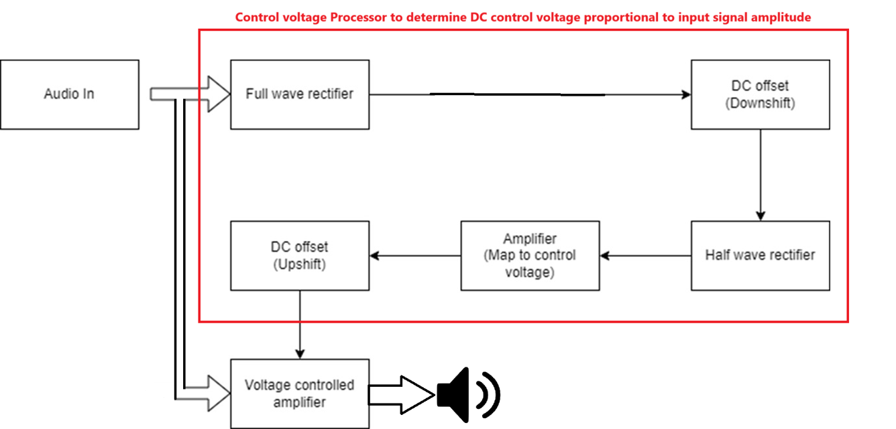

# Analog Volume Expander

**Real-time audio volume expander to enhance the dynamic range of audio signals.**

## 📖 Project Overview
This project involves the design and implementation of an **Analog Volume Expander**, which enhances the dynamic range of audio signals by applying upward expansion. It is tailored for applications like recording, broadcasting, and live sound systems.

### Key Features
- Real-time signal processing with minimal latency.
- User-configurable threshold and expansion ratio.
- Efficient **Control Voltage Processor** and **Voltage-Controlled Amplifier (VCA)**.
- Integrated notch filter to eliminate power line interference.
- Dual-layer PCB design and custom 3D-printed enclosure.

---

## 🛠 System Design
### Functional Block Diagram

### Core Components
- **Control Voltage Processor**: Processes the input signal to generate control voltages.
- **Voltage-Controlled Amplifier (VCA)**: Adjusts the gain dynamically.
- **Notch Filter**: Removes power line noise (50Hz).
- **Power Supply**: Provides stable and isolated power to the system.

For detailed system architecture and schematics, refer to the [Project Report](docs/Project_Report.pdf).

